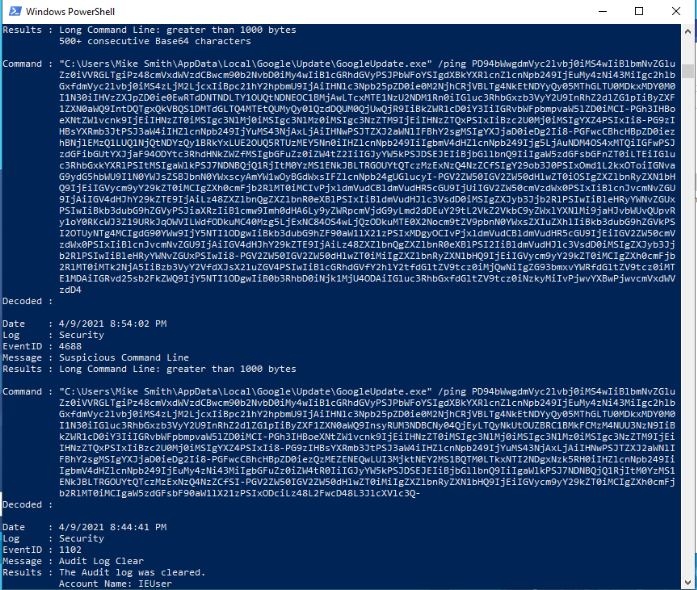
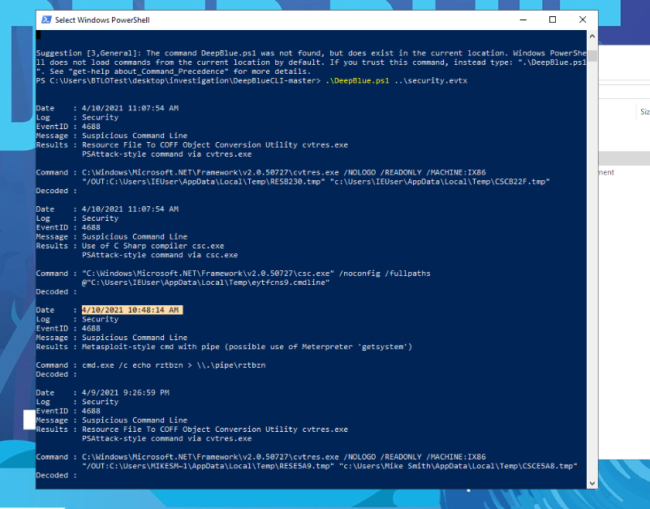
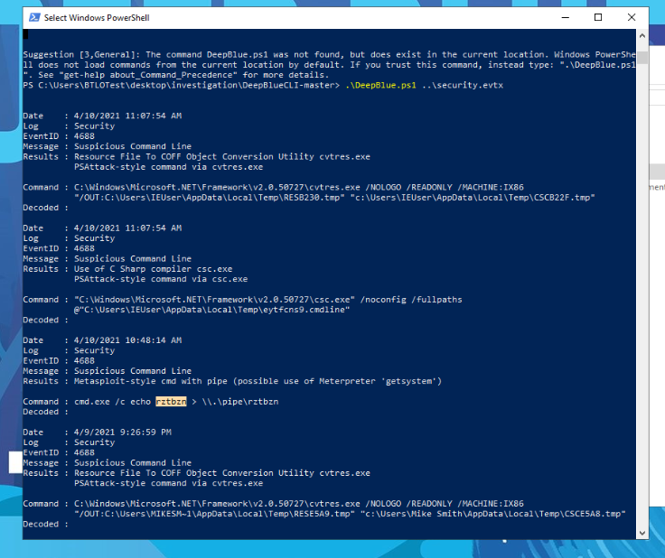
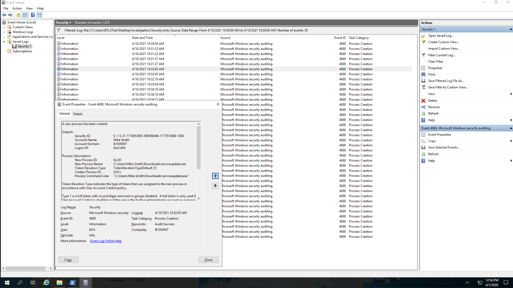
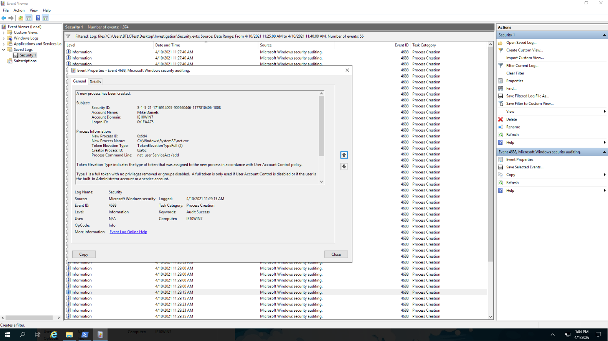
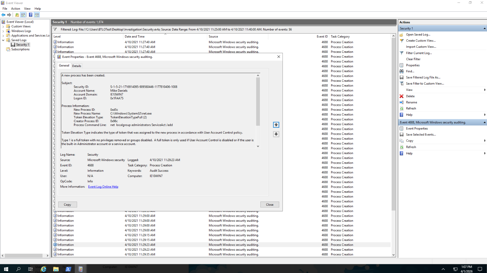

# Deep-Blue-Windows-Event-Log-Analysis
Windows Event Log Analysis using DeepBlueCLI to investigate RDP brute-force attack and suspicious activity from Security.evtx and System.evtx

# Windows Event Log Analysis – Deep Blue Lab

**Lab**: Blue Team Labs Online – Deep Blue  
**Focus**: Threat Hunting & Windows Event Log Investigation

---

### Executive Summary
I conducted a detailed investigation of Windows Security and System event logs to uncover signs of an RDP brute-force attack, malicious process execution, Meterpreter activity, and persistence techniques. I used **DeepBlueCLI** for automated analysis and **Event Viewer** for manual verification.

### Tools Used
- DeepBlueCLI  
- Windows Event Viewer  
- Security.evtx & System.evtx logs

### Investigation Process & Findings

**Question 1: Which user account ran GoogleUpdate.exe?**  
I analyzed the Security.evtx log using DeepBlueCLI. The tool flagged a long encoded command line involving `GoogleUpdate.exe`. Upon checking the details, the process was executed under the **NT AUTHORITY\SYSTEM** account — the highest privilege level on Windows.

  
*DeepBlueCLI showing the suspicious encoded command line related to GoogleUpdate.exe.*

**Question 2: At what time is there likely evidence of Meterpreter activity?**  
DeepBlueCLI highlighted suspicious activity involving `cmd.exe` with a named pipe at **10:48:14 AM** on 10th April 2021 — a common sign of Meterpreter usage.

  
*DeepBlueCLI output clearly marking the timestamp of suspicious Meterpreter-style activity.*

**Question 3: What is the name of the suspicious service created?**  
DeepBlueCLI detected multiple suspicious PSAttack-style commands and activity related to a named pipe (`rztbzn`), which is frequently used by Meterpreter.

  
*DeepBlueCLI results showing suspicious command lines and Meterpreter pipe activity.*

**Question 4: Identify the malicious executable downloaded for Meterpreter reverse shell**  
Through Event ID 4688 (Process Creation), I identified `ServiceUpdate.exe` as the malicious executable used to establish the Meterpreter reverse shell.

  
*Event Viewer showing the creation of the malicious executable ServiceUpdate.exe.*

**Question 5: Command line for persistence account creation?**  
Event ID 4688 captured the command `net user ServiceAct /add`, which was used to create a new persistence account.

  
*Event Viewer displaying the net user command used to create the persistence account "ServiceAct".*

**Question 6: Which two local groups was the account added to?**  
The newly created account "ServiceAct" was added to two privileged groups:

  
*Event Viewer showing the account being added to the Administrators group.*

  
*Event Viewer showing the account being added to the Remote Desktop Users group.*

### Key Takeaways
- Event ID 4688 (Process Creation) is one of the most important events for detecting attacker tools and persistence.
- DeepBlueCLI is very effective for quickly finding suspicious activity in large logs.
- Combining automated tools with manual Event Viewer analysis gives strong visibility during investigations.
- This lab greatly improved my practical threat hunting and log analysis skills — essential for any SOC or Blue Team role.

---

🛡️ Vihanga | Blue Team Journey

Connect with me: 
