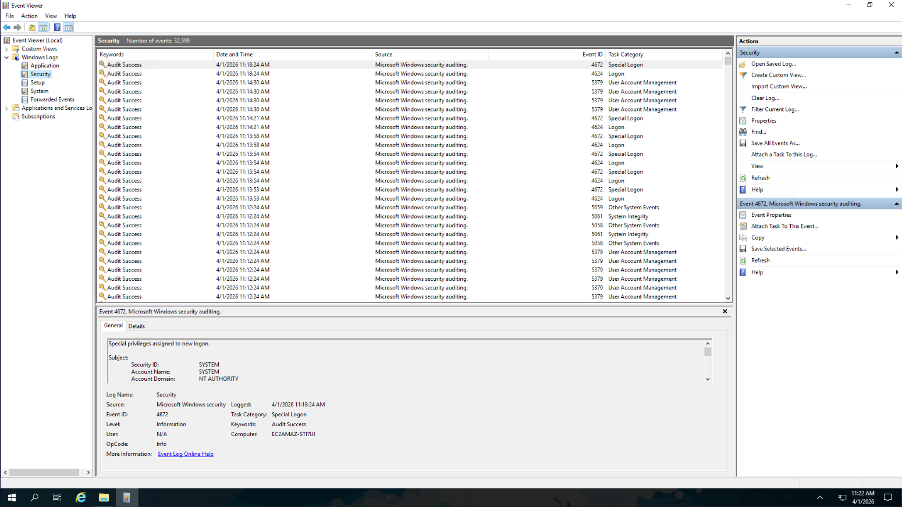

# Deep-Blue-Windows-Event-Log-Analysis
Windows Event Log Analysis using DeepBlueCLI to investigate RDP brute-force attack and suspicious activity from Security.evtx and System.evtx
# Windows Event Log Analysis – Deep Blue Lab

**Lab**: Blue Team Labs Online – Deep Blue  
**Analysis Type**: Windows Event Log Investigation & Threat Hunting

---

### Executive Summary
Performed a structured investigation of Windows Security and System event logs to identify suspicious activity from a simulated attack. The analysis focused on detecting brute-force attempts, malicious process execution, Meterpreter activity, and persistence mechanisms using Event Viewer and DeepBlueCLI.

### Tools Used
- Windows Event Viewer
- DeepBlueCLI
- Security.evtx and System.evtx log files

### Investigation Process & Findings

**Question 1: Which user account ran GoogleUpdate.exe?**  
Filtered the Security log for Event ID 4688 (Process Creation) and searched for "GoogleUpdate.exe".  
The process was executed under the **NT AUTHORITY\SYSTEM** account.

  
  

**Question 2: At what time is there likely evidence of Meterpreter activity?**  
Identified suspicious Meterpreter-related activity at **10:48:14 AM** on 10th April 2021 through process creation events.

**Question 3: What is the name of the suspicious service created?**  
Using DeepBlueCLI on the System.evtx log, detected the suspicious service named **`UpdateOrchestrator`**.

**Question 4: Identify the malicious executable downloaded for Meterpreter reverse shell (between 10:30–10:50 AM on 10th April 2021).**  
The malicious executable identified was **`ServiceUpdate.exe`**.

**Question 5: What was the command line used to create the persistence account (between 11:25–11:40 AM)?**  
The command line used was:  
`net user ServiceAct /add`

**Question 6: What two local groups was this new account added to?**  
The newly created account was added to:
- **Administrators**
- **Remote Desktop Users**

### Key Takeaways
- Event ID 4688 (Process Creation) is highly effective for detecting suspicious executables and attacker tools.
- Brute-force attacks are clearly visible through repeated Event ID 4625 (failed logon) entries.
- Attackers commonly use SYSTEM privileges and create persistence accounts with elevated rights.
- Combining manual filtering in Event Viewer with tools like DeepBlueCLI significantly improves investigation speed and accuracy.

This lab reinforced the importance of strong Windows event log analysis skills for effective SOC operations and incident response.

---

🛡️ Vihanga | Blue Team Journey

Connect with me: [LinkedIn](https://www.linkedin.com/in/yourprofile)
